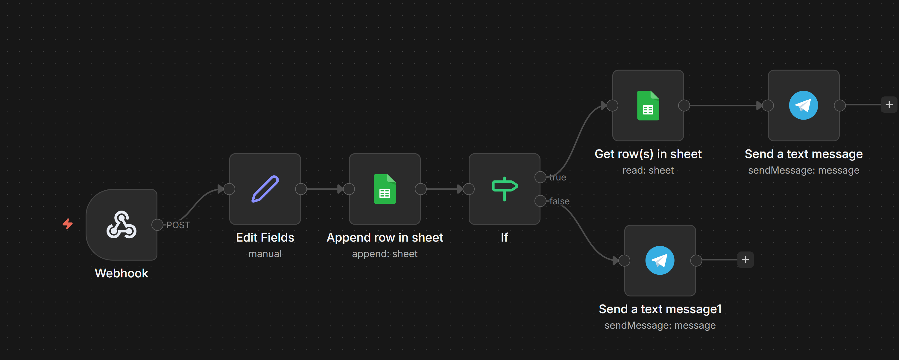

 🏠 Real Estate Lead Tracking System (n8n)

 📌 Description

This project is an automated real estate lead tracking system built with n8n.
It captures incoming prospect data via webhook, stores it in Google Sheets, checks existing entries, and sends notifications via Telegram.

 ⚙️ Technologies Used

* n8n (workflow automation)
* Webhook (lead input)
* Google Sheets
* Telegram Bot

 🔄 Workflow Steps

1. Webhook → receives prospect data
2. Edit Fields → processes and formats information
3. Append Row → stores data in Google Sheets
4. IF Node → checks conditions (new/existing lead)
5. Actions:

   * Retrieve existing data (Google Sheets)
   * Send Telegram notification

 📸 Workflow Screenshot

 🛠️ How to Use

1. Import `workflow.json` into n8n
2. Configure webhook endpoint
3. Connect Google Sheets
4. Set up Telegram bot
5. Activate the workflow

 🎯 Use Case

Automate the tracking and management of real estate prospects in real-time.

 👨‍💻 Author

Ziad El Yazidi
